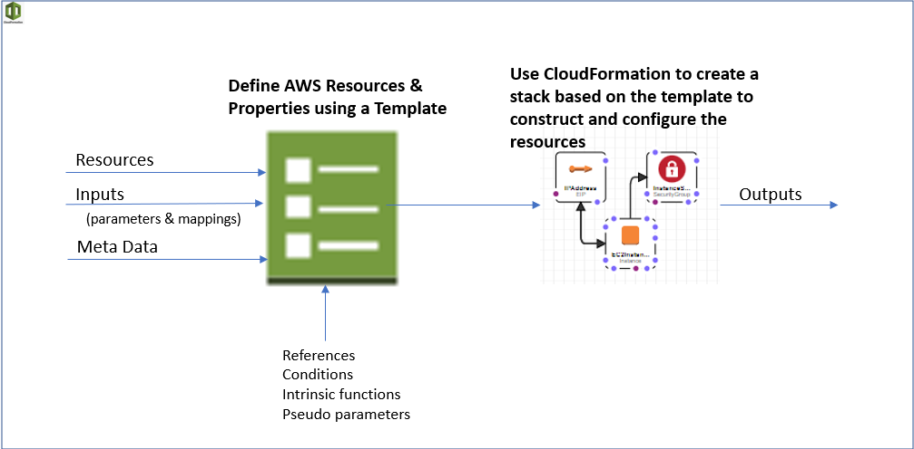

**[CloudFormation](https://docs.aws.amazon.com/AWSCloudFormation/latest/UserGuide/Welcome.html) is an AWS service that helps user to model, setup, configure and manage resources.**

- Simplify infrastructure management
- Quickly replicate the infrastructure
- Easily  control and track infrastructure changes 

Below is high-level flow and the basic building blocks of CloudFormation with links to AWS documentation. Some sample templates have been included in this repo for tutorial purpose.

## CloudFormation Building Blocks

| Component                                                    | Example                                                      | Documentation                                                |
| ------------------------------------------------------------ | ------------------------------------------------------------ | ------------------------------------------------------------ |
| AWSTemplateFormatVersion: identifies the capabilities of the template | AWSTemplateFormatVersion: "2010-09-09"                       | https://docs.aws.amazon.com/AWSCloudFormation/latest/UserGuide/format-version-structure.html |
| Description: Comments about the template                     |                                                              |                                                              |
| Transform: specifies one or more Macros that used to process the template |                                                              | https://docs.aws.amazon.com/AWSCloudFormation/latest/UserGuide/transform-section-structure.html |
| Metadata: To provide details about the template implementation Metadata keys Some AWS CloudFormation features retrieve settings or configuration information that you define in the Metadata section. You define this information in the following AWS CloudFormation-specific metadata keys:  AWS::CloudFormation::Init Defines configuration tasks for the cfn-init helper script. This script is useful for configuring and installing applications on EC2 instances. For more information, see AWS::CloudFormation::Init.  **AWS::CloudFormation::Interface ***Defines the grouping and ordering of input parameters when they are displayed in the AWS CloudFormation console making the flow more user friendly*. By default, the AWS CloudFormation console alphabetically sorts parameters by their logical ID. For more information, see AWS::CloudFormation::Interface.  AWS::CloudFormation::Designer Describes how your resources are laid out in AWS CloudFormation Designer (Designer). Designer automatically adds this information when you use it to create and update templates. For more information, see What is AWS CloudFormation Designer?. | Metadata:   Instances:     Description: "Information about the instances"   Databases:      Description: "Information about the databases" | https://docs.aws.amazon.com/AWSCloudFormation/latest/UserGuide/metadata-section-structure.html |
| Resources: AWS resources declared in the template (MANDATORY) | Resources:   EC2Instance:     Type: AWS::EC2::Instance     Properties:       InstanceType:         !FindInMap [           EnvironmentToInstanceType,           !Ref "EnvironmentName",           instanceType         ]       # Note we use the pseudo parameter AWS::Region       ImageId: !FindInMap [AWSRegionArch2AMI, !Ref "AWS::Region", HVM64] | https://docs.aws.amazon.com/AWSCloudFormation/latest/UserGuide/template-reference.html |
| Parameters: The dynamic inputs for your template             | Parameters:   EnvironmentName:     Description: Environment Name     Type: String     AllowedValues: [development, production]     ConstraintDescription: must be development or production | https://docs.aws.amazon.com/AWSCloudFormation/latest/UserGuide/parameters-section-structure.html |
| Mappings: The static variables (usually known ahead of time) | Mappings:   AWSRegionArch2AMI:     af-south-1:       HVM64: ami-06db08e8636583118     ap-east-1:       HVM64: ami-0921e2da2f22f9617     ap-northeast-1:       HVM64: ami-06098fd00463352b6 | https://docs.aws.amazon.com/AWSCloudFormation/latest/UserGuide/mappings-section-structure.html |
| Outputs References to what has been created  The output of one stack can be used as the input of another stack The export name should be unique among the stacks | Outputs:   StackSSHSecurityGroup:     Description: The SSH Security Group for our Company     Value: !Ref MyCompanyWideSSHSecurityGroup     Export:       Name: SSHSecurityGroup | https://docs.aws.amazon.com/AWSCloudFormation/latest/UserGuide/outputs-section-structure.html |
| Conditionals: List of conditions to perform resource creation | Parameters:   EnvType:     Description: Environment type.     Default: test     Type: String     AllowedValues:       - prod       - test     ConstraintDescription: must specify prod or test.  Conditions:   CreateProdResources: !Equals [!Ref EnvType, prod] | https://docs.aws.amazon.com/AWSCloudFormation/latest/UserGuide/conditions-section-structure.html |
| Rules: Validate a parameter or a combination of parameters during stack creation/update (Type, Min/MaxLength, Min/MaxValue, AllowedValues, AllowedPattern) | Rules:   testInstanceType:     RuleCondition: !Equals        - !Ref Environment       - test     Assertions:       - Assert:           'Fn::Contains':             - - a1.medium             - !Ref InstanceType         AssertDescription: 'For a test environment, the instance type must be a1.medium'   prodInstanceType:     RuleCondition: !Equals        - !Ref Environment       - prod     Assertions:       - Assert:           'Fn::Contains':             - - a1.large             - !Ref InstanceType         AssertDescription: 'For a production environment, the instance type must be a1.large' | https://docs.aws.amazon.com/AWSCloudFormation/latest/UserGuide/rules-section-structure.html |
|                                                              |                                                              |                                                              |

